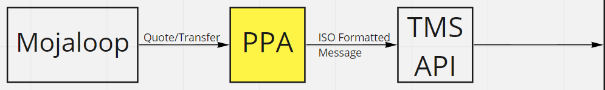
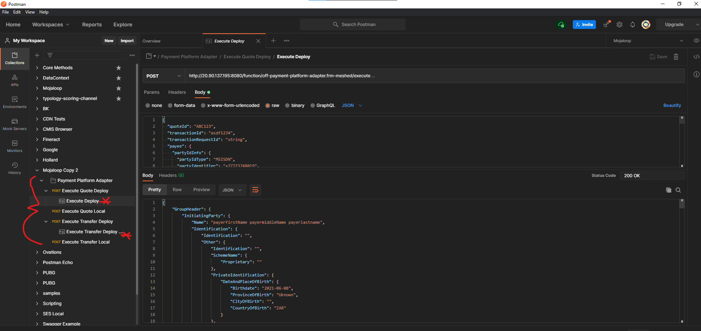
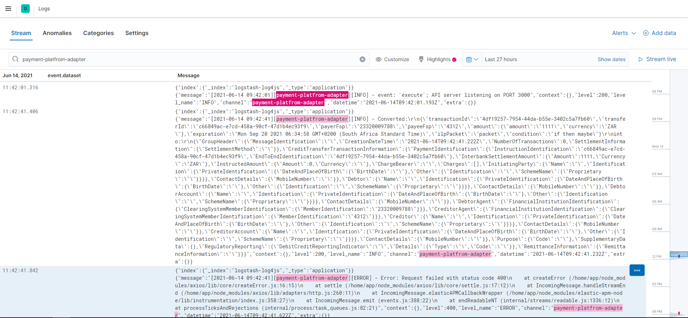

# Payment Platform Adapter (PPA)



The PPA is the first step between Mojaloop and Tazama. It accepts Mojaloop formatted messages and convert them to ISO formatted messages, then forwards that off to the TMS Api. The mapping for that can be found below.

[Mojaloop_to_ISO20022_mapping_V1.1_20210531.xlsx](./Mojaloop_to_ISO20022_mapping_V1.1_20210531.xlsx)

Mojaloop POST Quote → ISO20022.pain.0-01.001.11

Mojaloop POST Transfer → ISO20022.pacs.008.001.10

## Repository

[https://github.com/mojaloop/fraud\_risk\_management/tree/master/payment-platform-adapter](https://github.com/mojaloop/fraud_risk_management/tree/master/payment-platform-adapter)

## Usage

Using the attached Postman collection, there are samples for the Quote and Transfer calls, with Examples showing the expected output.

[Mojaloop.PPA.postman_collection.json](./attachments/Mojaloop.PPA.postman_collection.json)



## Logging

Logs can be found in Elastic. It makes use of the [@log4js-node/logstash-http](https://www.npmjs.com/package/@log4js-node/logstash-http) library to stream logs via http to our LogStash endpoint, showing in the [Elastic dashboard](http://51.132.53.172:5601/app/logs/stream?flyoutOptions=(flyoutId:!n,flyoutVisibility:hidden,surroundingLogsId:!n)&logPosition=(end:now,position:(tiebreaker:23,time:1623686351040),start:now-1d,streamLive:!f)&logFilter=(expression:payment-platfrom-adapter,kind:kuery)) .



## Features

For this ticket, all supported dialing codes were used from: `https://en.wikipedia.org/wiki/List_of_country_calling_codes`

Here is a code snippet:

```javascript
const dialingCodes = \[
  "1", "20", "27", "211", "212", "213", "216", "218", "220", "221", "222", "223", "224", "225", "226", "227", "228", "229", "230", "231", "232", "233", "234", "235", "236", "237", "238", "239", "240", "241", "242", "243", "244", "245", "246", "247", "248", "249", "250", "251", "252", "253", "254", "255", "256", "257", "258", "260", "261", "262", "263", "264", "265", "266", "267", "268", "269", "290", "291", "297", "298", "299", "30", "31", "32", "33", "34", "36", "39", "350", "351", "352", "353", "354", "355", "356", "357", "358", "359", "370", "371", "372", "373", "374", "375", "376", "377", "378", "379", "3801", "381", "382", "383", "385", "386", "387", "389", "40", "41", "43", "44", "45", "46", "47", "48", "49", "420", "421", "423", "51", "52", "53", "54", "55", "56", "57", "58", "500", "501", "502", "503", "504", "505", "506", "507", "508", "509", "590", "591", "592", "593", "594", "595", "596", "597", "598", "599", "60", "61", "62", "63", "64", "65", "66", "670", "672", "673", "674", "675", "676", "677", "678", "679", "680", "681", "682", "683", "685", "686", "687", "688", "689", "690", "691", "692", "7", "81", "82", "84", "86", "800", "808", "850", "852", "853", "855", "856", "870", "878", "880", "881", "882", "883", "886", "888", "91", "92", "93", "94", "95", "98", "960", "961", "962", "963", "964", "965", "966", "967", "968", "970", "971", "972", "973", "974", "975", "976", "977", "979", "991", "992", "993", "994", "995", "996", "997", "998"
\]

String.prototype.toMobileNumber = function (this: string): string {
  if (!this || this.length < 4)
    return this;
  let toReturn = this.replace('+', '').replace(' ', '').replace('(', '').replace(')', '');
  for (let index = 0; index < dialingCodes.length; index++) {
    const element = dialingCodes\[index\];
    if (toReturn.startsWith(element)) {
      toReturn = \`+${element}-${toReturn.substr(element.length)}\`;
      return toReturn;
    }
  }
  return "";
};
```

[https://lextego.atlassian.net/browse/AM-397](https://lextego.atlassian.net/browse/AM-397)

This ticket made some updates to the Pain model, as the version updated from v10 to v11.
